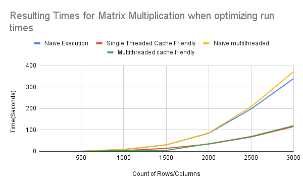

# Project 1: Matrix Multiplication
## How To Run
1. Download Code from GIT
2. In terminal type "make clean all"
3. Type "./main"

## Implementations
First, give a short summary of the multipliers here implemented, perhaps just a list with a short description for each item. Keep it at a high level, hinting at what are the techniques or key concepts that motivated its inclusion. For example:

- **Naive implementation**: Standard Matrix Multiplication

### Single Threaded Cache Friendly Version

#### Theoretical concept
- loop order
    This should improve efficiency by accessing the resources in a certain order. By accessing by rows instead of columns the data is accessed in order in the cache.
- resource accessing
    This improves efficiency by only writing the resulting sum into C in the main memory at the end of the loop instead of during the loop which would slow down access time. Also for B it is stored in a column variable. Which improves memory access time
#### Code organization
Single Threaded Cache Friendly is multiple for loops that access the Mat data structure. This structure has height and width define along with a pointer to the start of the matrix.

In one fo the loops, B's colomn is stored into a seprate variable. This is done to have a variable that can be multiplied with A without having to access B from main memory. 

In the inner most loops we have a sum that is used to store the values from the multiplication done by A and B and then at the end it is saved in to C. Instead of writing to C in main memory each time we multiply a times b we only do it once for each cell in c. 

### Mulithreaded not cache friendly version

#### Theoretical concept
- Multiple Threads
    This should improve efficiency by splitting up the work into 4 different threads

#### Code organization
The multithreaded not cache friendly version is a copy of the single threaded base implementation. The only substantial change to it is instead of sequentially accessing the rows. Each thread accesses a shared variable that is the rows index and does work on that row

### Mulithreaded cache friendly version

#### Theoretical concept
- loop order

This should improve efficiency by accessing the resources in a certain order. By accessing by rows instead of columns the data is accessed in order in the cache.
- resource accessing

This improves efficiency by only writing the resulting sum into C in the main memory at the end of the loop instead of during the loop which would slow down access time.

- Multiple Threads
    
    This should improve efficiency by spliting up the work into 4 different threads
    
#### Code organization
Multithreaded cache friendly version is designed to first split up the matrix into 4 equal parts to work on. Then it performs their own constrained matrix multiplication. Where the loops are ordered to take advantage of access time and then summing the result for c into a variable and then writing to C at the end of the summation. 

## Metrics and tests
In this project, we are evaluating three things (these are the **what** we are measuring):

- Total execution time.
- Good use of multiple cores.
- Good use of cache memory system.

- **How** are you defining "Good use of multiple cores".
    
    A good use of a multiple core system is choosing the correct number of threads that take advantage of running a different thread into a different core. Using too little threads would be taking advantage of an idle core. While using too many threads would have threads waiting for each other to finish to continue execution. 
- **How** are you defining "Good use of cache memory system".

A good use of a cache memory system is storing parts of variables into cache memory to access later in order instead of having to read/write from memory for the whole execution. 
- **What** are the experiments/benchmarks that you ran in order to measure the metrics described above.

In order to see good use of multiple cores and cache memory system we compared execution time varying the different parameters and code organization. 

- What environment did you use to run your experiments.

These experiments were run on a the ICS lab machines 

Model Name: Intel(R) Xeon(R) CPU X5680 @ 3.33GHz
Total Number of Cores:	6
- What tests did you run to verify that the actual multiplication is correct.
To verify that the multiplication was done correctly we printed out the 25 x 25 matrix's and compared them to the naive implementation. We choose this size and not a smaller one because it would be bigger than the 16 int long blocks of cache we used. We also choose not to use a bigger size because the printed results would be so large that they would be hard to check each column.

## Findings and Interpretations
- What were your findings.

PS - We found our execution time to be largely dependent on cache optimizations rather than thread count. As can be seen in the data, multithreading had little performance improvement over single threading when cache optimization wasn't accounted for.

- How can they be interpreted.

Based on the results it is clear that the slowest implementations was the multithreaded not cache friendly and the single threaded version. The multithreaded not cache friendly version was the slowest even though it had multiple threads. This is probably because it has to read and write to the same variable. Which would cause interference in main memory. Slowing down the execution time as a whole.

The cache friendly versions are around the same time. But in the larger matrices the single threaded cache friendly version beats out the multithreaded cache friendly version. This could be because of the same issue of accessing the same shared variables with the reads and writes even though it is taking advantage of the cache. 

The Multithreaded Times are almost always the same for the single threaded ones. Which is strange, from testing the code on multiple machines. Sometimes the multithreaded are faster and sometimes are slower. In order to have the best results we used a native linux machine instead of a Mac and Windows computer. 

- What is the take-away of this project.

When writing code that is cache friendly mulithreaded and single threaded code can show a significant speed up even when they have the same O(n^3) execution time.
- What did you learn.

Single threaded cache friendly is the fastest implementation of matrix multiplication. By having it's own resources and using the cache friendly it can beat out the execution time of a multithreaded cache friendly execution time.
- What can be done in the future.
To improve a multithreaded cache friendly execution time having separate variable to process on would probably speed up the execution times and then after all the threads have been processed the separate C's that were calculated could be recombined in a single threaded manner. 
