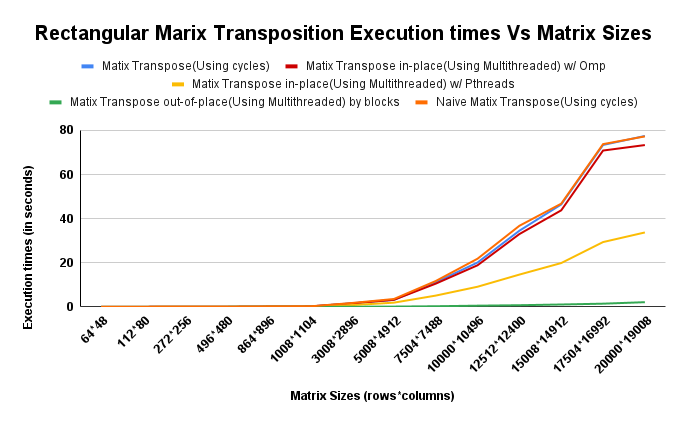

# Project 2: Matrix Transpose

## Implementations
For our project we have two types of transposition N x N and N x M.
#### How to Run Code
1. Download Code from repo
2. In terminal run "Make Clean All"
3. In terminal run "./main"

The matrix dimensions are predefined in main.c. The code was ran on the CS Lab machines. 
##### Square Matrix Transposition 

- **Naive implementation**: Traditional implementation of matrix transposition with two nested for loops.
- **Sequential Transposition**: Inplace sequential transposition without any multiplication or division to find indexes. 
- **Multithreaded Transposition out of place**: Multithreaded matrix transposition out of place. 
- **Multithreaded Transposition in place**: Multithreaded matrix transposition in place. 

### Sequential Transposition

#### Theoretical concept
- Computationally Expensive Operations (Efficient FLOPS).
By avoiding the use of expensive operations like multiplication and division and instead using addition and subtraction. We can save computation time when finding indexes in the array. Thus being efficient in the amount of FLOPS we use.  
- Efficient use of memory hierarchy (cache friendly).
By doing all the calculations in place and not in another matrix we can reference only one structure in memory. We go by row for the upper triangular matrix which has efficient look up time. Though for the lower triangular matrix we have to go by column to find the correct value to replace. 

#### Code organization
Sequential matrix transposition is organized in such a way to traverse the whole matrix transposing the correct rows and columns. The code begins with a starting index in the matrix, this is the first value in the upper triangular matrix excluding the diagonal values. From this value the lower triangular matrix index can be found by adding n and subtracting 1 from the value. With these two indexes we can traverse the first row and column. The first row is done sequentially and the first column is done by adding n to the starting value. After reaching the end of the row or column the code finds the next starting index and the cycle repeats itself until it finishes with the matrix. 
### Multithreaded Transposition out of place
#### Theoretical concept
- Efficient use of multiple processing units (parallelism).
By splitting up the work between multiple threads in theory the matrix transposition should be faster

#### Code organization
This code uses Omp to do the the matrix transposition out of place. 

### Multithreaded Transposition in place
#### Theoretical concept
- Efficient use of multiple processing units (parallelism).
By splitting up the work between multiple threads in theory the matrix transposition should be faster
- Inplace matrix transposition
In theory by being in place it should be quicker than not in place code.

#### Code organization
This code uses Omp to do the the matrix transposition in place. It is transposition by cycles for square matrices. Since it is only for square matrices it avoids computation by not looking for loops because all loops would be one unit long. 

##### Rectangular Matrix Transposition 
- **Naive implementation**: Implementation of rectangular matrix transposition using code from professor. 
- **Cycles Transposition**: Semi improved version of professors matrix transposition with a bit of loop unfolding to avoid doing unneeded work. 
- **Multithreaded Cycles Transposition w/ Omp** Multithreaded in place matrix transposition using Omp
-  **Multithreaded Cycles Transposition by blocks** Multithreaded out of place matrix transposition by blocks 
- **Multithreaded Cycles Transposition w/ Pthreads** Multithreaded in place matrix transposition using Pthreads
### Cycle Transposition 

#### Theoretical concept
- Loop unfolding
In this updated code from the professor we are doing look unfolding. When looking at the original code the while loop the finds the cycles is inefficient for the first few cycles. Loop unfolding avoids unnecessary operations.

#### Code organization
This code is basically the same from the professors code with one main change. There is an added while loop. This adds volume to the professors code but it also unfolds the loop a bit. This code is only the transposition part of the second while loop without finding the cycles. For the first few cycles it is unneeded to check whether a cycles has been visited or not because since the starting numbers are so low they wouldn't have been visited. It starts at the index of 1 and transposes the full cycle. The only change is it finds the minimum value in that cycle, excluding the start. From this value we know that as long as the next cycle is less than the minimum value we haven't seen it yet. So there is no need to check if the cycle is visited. For each next cycle we check and update the minimum value. Once the start value is this minimum value the code continues on to the original while loop with the starting value being that minimum value.

### Multithreaded Cycles Transposition w/ Omp
#### Theoretical concept
- Efficient use of multiple processing units (parallelism).
By splitting up work into multiple threads in theory the code should run faster.

#### Code organization
This code uses Omp to split up work between four different threads. This is the parallelized version of transposition by cycles. 

### Multithreaded Cycles Transposition by blocks
#### Theoretical concept
- Efficient use of multiple processing units (parallelism).
By splitting up work into multiple threads in theory the code should run faster.
- Transposition by blocks (Cache Friendly).
By transposing different blocks of memory at a time it takes advantage of the cache. 

#### Code organization
This code is an out of place transposition by blocks. It first splits up the work that needs to be done into parallel threads. Then it transposes the matrix by blocks from one matrix to another

### Multithreaded Cycles Transposition w/ Pthreads
#### Theoretical concept
- Efficient use of multiple processing units (parallelism).
By splitting up work into multiple threads in theory the code should run faster.

#### Code organization
This code uses Pthreads to split up work between four different threads. This is the parallelized version of transposition by cycles. 
## Metrics and tests
- **How** are you defining "Good use of multiple cores".

A good use of a multicore system would be splitting up the work of a project between different threads semi evenly to see a noticeable speed up. 
- **How** are you defining "Good use of cache memory system".

A good use of a Good use of cache memory system would be taking advantage of the size of the cache to do work that is faster with memory accesses. 
- **What** are the experiments/benchmarks that you ran in order to measure the metrics described above.

We compared the run times of each matrix transposition to see which version was the best. For nxn matrices we did 3 new matrix transpositions. One is sequential and two are multithreaded. There is an inplace and out of place multithreaded transposition. 

For nxm matrix transposition we have 4 new matrix transposition. One is a updated sequential cycles transposition. While three of them are multithreaded. There are two inplace multithreaded ones with different multithreaded libraries and one out of place multithreaded cache friendly version. 
- What environment did you use to run your experiments.

We used the CS lab machines to run all the experiments to ensure the system doesn't change. It is a six core Intel(R) Xeon(R) CPU X5680  @ 3.33GHz machine.
- What tests did you run to verify that the actual multiplication is correct.

To verify correctness of the code we have each transposition transpose the same matrix and then compare all those matrix to our naive implementation to see if they are equal. 

## Findings and Interpretations
- What were your findings.

Note: Even though the lab machines is a 6 core machine we only tested with 4 cores. For the Square matrix transposition the multithreaded inplace times were omitted from the graph because the times were slower than the sequential times. This is probably because it was doing matrix transposition by cycles which is fairly slow when compared to the other methods of matrix transposition for square matrices. 
- How can they be interpreted.

For Square matrix's it is clear to see that multithreaded version of the code is the fastest even though it is out of place. Though without multithreaded sequential matrix transposition is significantly faster than out naive implementation. Even for large matrix. 

For rectangular matrix's the transposition code for cycles is fairly optimized as it is. When we tried to optimize it for sequential code it was only faster in some instances but not other. Even though the code is skipping operations by not looking for cycles in the first indexes. 
When it comes to multithreaded we have three versions. There are two that parallelizes the cycles code but uses different thread libraries. The Pthreads version is much faster than the Omp version for the multithreading. This might be because of the overhead it takes to create the Omp threads and the finer grain control we have over pthread creating. The fastest multithreading version is the one by blocks. It is significantly faster than all the other versions because it uses threads and the cache effectively, but it is a code that is out of place meaning double the memory is needed to run it. 

Square matrix transposition is almost always faster than rectangular matrix transposition. 
- What is the take-away of this project/ What did you learn.

When it comes to multithreading it really matters what code you are multithreading and what type of multithreaded libraries you use. Omp can be efficient multithreading but can also add a lot over overhead that pthreads doesn't. Also out of place transposition is faster than inplace transposition but uses a lot more memory. 
By cycles is a slow way to transpose a matrix when compared to any of the square matrix transposition. If there is enough space in a computer it might be faster to add 0 padding to make a matrix square to transpose. Then shuffle the block of code around after removing the padding. 

- What can be done in the future.

There is probably a better way to do square matrix transposition that takes advantage of the caches. Also the matrix transposition by blocks could be written using pthreads and might see even more of a speed up. 
