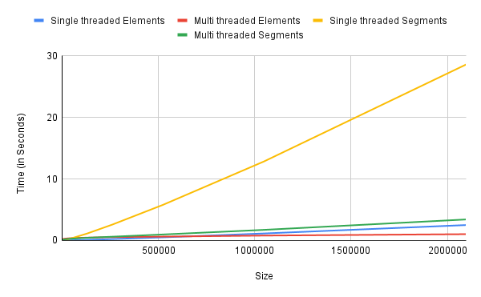

# Project 3: Bitonic sort

## Implementations
For our project we have implemented Bitonic Sorting in four ways - Element Wise (Single threaded and Multi threaded) and Segment Wise (Single threaded and Multi threaded).
#### How to Run Code
1. Download Code from repo
2. In terminal run "make clean all"
3. In terminal run "./main"

The size of array to be sorted are predefined in main.c. The code was ran on the CS Lab machines.
##### Bitonic Sort 

- **Element Wise**: Sort by elements
- **Segment Wise**: Sort by segments 
- **Multithreaded Element Wise**: Sort by elements w/ Multithreaded.
- **Multithreaded Segment Wise**: Sort by segments w/ Multithreaded.

### Bitonic Sort (Element Wise)

#### Theoretical concept
1. Standard bitonic sort by elements

#### Code organization
This is a typical bitonic sort by elements without using recursion. Since with recusion it is harder to follow along with the code.

### Bitonic Sort (Segment Wise)
#### Theoretical concept
1. By segments (Cache Friendly) by doing bitonic sort by segments the code can take advantage of being cache friendly by accessing elements close to each other.
2. No size constraint by adding padding to an array the code can work on an array of any size.
#### Code organization
To sort by segments the code first find the amount of segments need for a certain input size. The size of each segment is 8 elements long. Then it does a typical bitonic sort on these segment indexs like they are element indexes. When the code need to merge two segments it goes into a merge method with the index of the segments. 
In the merge method the segments starting and ending indexs are found and those sections are sorted based on insertion sort. By the end of bitonic sort the whole array is sorted. 

### Multithreaded Bitonic Sort (Element Wise)
#### Theoretical concept
1. Standard bitonic sort by elements.
2. Multithreading by multithreading the program the calculations are being done on multiple cores at once. 

#### Code organization
This is a typical bitonic sort by elements but using Omp the work is split between four different threads. 

### Multithreaded Bitonic Sort (Segment Wise)
#### Theoretical concept
1. By segments (Cache Friendly) by doing bitonic sort by segments the code can take advantage of being cache friendly by accessing elements close to each other.
2. No size constraint by adding padding to an array the code can work on an array of any size
3. Multithreading by mulitithreading the program the calculations are beign done on multiple cores at once. 

#### Code organization
To sort by segments the code first find the amount of segments need for a certain input size. The size of each segment is 8 elements long. Then the code splits into multiple threads to work on the data. After that it does a typical bitonic sort on these segment indexes like they are element indexes. When the code need to merge two segments it goes into a merge method with the index of the segments. 
In the merge method the segments starting and ending indexes are found and those sections are sorted based on insertion sort. By the end of bitonic sort the whole array is sorted. 

## Metrics and tests
- **How** are you defining "Good use of multiple cores".
A good use of multiple cores is being able to split up the code into multiple threads and seeing a decent speed up proportional to the amount of cores of the machine. 

- **How** are you defining "Good use of cache memory system".
A good use of cache memory is storing variables into the cache memory and doing work on them instead of using main memory. We should see a significant speed up.

- **What** are the experiments/benchmarks that you ran in order to measure the metrics described above.
To measure the metrics above we use execution time. 

- What environment did you use to run your experiments.
We are using the CS Lab machines to run the experiments Intel(R) Xeon(R) CPU X5680  @ 3.33GHz with 6 cores.

- What tests did you run to verify that the actual sorting is correct.

To verify correctness of the code we have added sortChecker method which verifies if the final sorted array is in ascending order.

## Findings and Interpretations
- What were your findings.

- How can they be interpreted.
Based on the data normal bitonic sort by elements using multithreaded is faster than anything we are doing with segments. But multithreaded by segments is not too much slower than the by elements. It also has the advantage of not having to be exactly 2^n elements as long as the array that is inputed into it has padding. The slowest algorithm is single threaded by segments which is almost 9 to 10 times slower than it's mulithreaded counter part. 

- What is the take-away of this project/ What did you learn.
By changing inefficient parts of the code by segments we were able to have significant speed up when compared to our original implementation. For a size of 2097152 with our original implementation sorting by segments was 108.7s and multithreaded was 10.4s. But with small changes to the code we decreased the numbers to be 28.4 and 3.5. Which is an almost 3X speed up. There were three changes that we made. One, was changing the segment size. Originally each segment was 2 elments and now each segmnet is 8 elements. Two, we saved the 2 segment data into one array to sort through and then copied it back into the original array. Lastly, we changed the sorting algorithm from selection sort to insertion sort. With these three improvements we saw significant speed up for the sorting by segments. 

- What can be done in the future.
There are possibly more ways to speed up by segments by changing the data strucutre or using a different sorting algorithm. With the normal bitonic sort there are probably better ways to access data smartly. Lastly for this project we used Omp as our mulithreaded library. We could implement these methods using pthreads and we might see more speedup but that would also require more work to verify correct implementation because there would need to be thought on blocking for each stage of the code.
